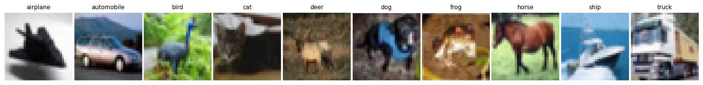

# Module 1.2 — CNN Basics

> Part 1 — Building Blocks · [DiT from Scratch](../README.md)

**Goal**: learn how CNNs process images by training two models on CIFAR-10 — first a classifier (supervised, easy to evaluate), then an encoder–decoder autoencoder (unsupervised, the direct precursor to the VAE inside DiT).

**Why this matters for DiT**: DiT doesn't operate on raw pixels — it operates on latents produced by a VAE. That VAE is a CNN encoder/decoder. The stride-2 `Conv2d` → `ConvTranspose2d` pattern you build here is the literal architecture of the VAE encoder and decoder in Stable Diffusion and DiT. The classifier gives you intuition for what the encoder learns before you add the decoder and reconstruction loss.

**Deliverables**:
- `train_classifier.py` training a CNN classifier on CIFAR-10, reaching ~70% test accuracy.
- `train_autoencoder.py` training a CNN autoencoder on CIFAR-10, with reconstructions visible in `reconstructions.png`.

## What the model learns

**CIFAR-10** is 60,000 32×32 RGB images across 10 classes. 50k train / 10k test. The classes are visually diverse and share no obvious low-level patterns — this forces the encoder to learn genuinely useful features rather than memorizing color statistics.



**Part A — Classification (supervised).** The model sees an image and a ground-truth label. It learns to output the correct class by minimizing CrossEntropyLoss. There is no decoder; the encoder must compress the image into a representation that makes the 10 classes linearly separable.

```
 input image                    latent               class scores
(3, 32, 32)  →  [Encoder]  →  (latent_dim,)  →  [Linear head]  →  (10,)
```

**Part B — Reconstruction (unsupervised).** No labels. The model compresses the image to a latent vector, then expands it back to pixels. It learns by minimizing per-pixel MSE (mean squared error — the average of `(x̂ᵢ - xᵢ)²` over all pixels) between the reconstruction and the original.

```
 input image                    latent                  reconstructed image
(3, 32, 32)  →  [Encoder]  →  (latent_dim,)  →  [Decoder]  →  (3, 32, 32)
```

The encoder discards information by passing the image through a bottleneck smaller than the input (3×32×32 = 3,072 values → 256 by default). What survives the bottleneck is what the encoder learned to treat as essential.

## Files

| File | What it is |
| --- | --- |
| `cnn.py` | `Encoder`, `Decoder`, `Autoencoder`, and `Classifier` modules with shape annotations and concept comments |
| `train_classifier.py` | Trains the classifier with CrossEntropyLoss; reports train/test accuracy per epoch |
| `train_autoencoder.py` | Trains the autoencoder with MSE reconstruction loss |
| `visualize.py` | Loads a checkpoint and plots a side-by-side grid of originals vs reconstructions |
| `demo/app.py` | Gradio webapp: click any test image to classify it interactively |

## Instructions

### 1. Set up

Python 3.9+. From `lab1.2/`:

```bash
python -m venv venv && source venv/bin/activate
pip install -r requirements.txt
```

Training auto-selects device: CUDA → Apple MPS → CPU. CIFAR-10 downloads to `./data/` on first run (~170 MB).

### 2. Train the classifier

```bash
python train_classifier.py
```

Default: Adam, lr=1e-3, 30 epochs, latent_dim=256. Per-epoch output:

```
epoch  1 |   9.2s | train_loss 1.7821  train_acc 0.361 | test_loss 1.5204  test_acc 0.449
...
epoch 30 |   8.8s | train_loss 0.8312  train_acc 0.710 | test_loss 0.9041  test_acc 0.688
```

A random 10-class classifier scores `loss ≈ 2.3` and `acc = 0.10` — watch both move as the encoder learns. A test accuracy of ~70% is typical for this architecture; deeper models (ResNet, VGG) reach 90%+.

### 3. How convolutions work

Open `cnn.py` and read the comments. The core ideas to lock in:

**Local receptive field.** Each output value in a conv layer depends only on a small spatial patch of the input (the kernel window). This is the key difference from an MLP, where every output depends on *all* inputs. CNNs are efficient because most inputs don't affect most outputs.

**Parameter sharing.** The same kernel weights are applied at every spatial position. A kernel that detects a horizontal edge at position (5, 5) uses the same weights as the one at position (12, 20). This is why CNNs generalize well: they don't have to re-learn features at every location.

**Channels as parallel detectors.** `out_channels=32` means 32 independent kernels run in parallel, each producing its own 2D output map. Deep in the network, each channel represents a different abstract feature.

**Stride-2 conv for downsampling.** With `stride=2`, the kernel jumps 2 pixels at a time → output is half the spatial size. Learnable, unlike MaxPool.

**Receptive field grows with depth.** After 3 stride-2 conv blocks, each output value in the `(128, 4, 4)` feature map has a receptive field covering the *entire* 32×32 input. The encoder truly "sees" the whole image before projecting to the latent.

### 4. Train the autoencoder

Now add the decoder. Same encoder backbone, but the latent is expanded back to pixels instead of classified:

```bash
python train_autoencoder.py
```

Default: Adam, lr=1e-3, 30 epochs, latent_dim=256. Per-epoch output:

```
epoch  1 |   8.3s | train_loss 0.02847 | test_loss 0.02134
...
epoch 30 |   8.1s | train_loss 0.00712 | test_loss 0.00748
```

`test_loss` is per-pixel MSE. A value around 0.007 means the average pixel error is roughly `sqrt(0.007) ≈ 0.084` on the [0,1] scale — visually imperfect but structurally recognizable. Shapes and colors come back; fine textures do not. That's a known limitation of MSE (it rewards blurry averages over sharp edges).

**ConvTranspose2d for upsampling.** The decoder's block doubles spatial size: it inserts zeros between input values, then applies a regular conv. The weights are learned — this is not bilinear upsampling.

### 5. Experiment with the latent dimension

The `--latent-dim` flag controls how aggressively the image is compressed. Run all three:

```bash
python train_autoencoder.py --latent-dim 32   --save-path ae_32.pt
python train_autoencoder.py --latent-dim 256  --save-path ae_256.pt   # default
python train_autoencoder.py --latent-dim 1024 --save-path ae_1024.pt
```

Larger latent → lower MSE, sharper reconstructions, but less compression. Smaller latent → higher MSE, blurrier reconstructions, but the model is forced to learn only the most essential structure.

The compression ratio for each:
- `latent_dim=32`:   3072 → 32  ≈ 96× compression
- `latent_dim=256`:  3072 → 256 ≈ 12× compression
- `latent_dim=1024`: 3072 → 1024 ≈ 3× compression

The point: there's a tradeoff between compression and fidelity. VAEs tune this via the KL weight (the β in β-VAE). DiT's VAE (from Stable Diffusion) uses a spatial latent (not a flat vector) at 8× spatial compression: a 512×512 image becomes a 64×64×4 tensor — a much milder compression than `latent_dim=32` here.

### 6. Visualize reconstructions

```bash
python visualize.py --ckpt cnn_autoencoder.pt --save reconstructions.png
```

Two rows: originals on top, reconstructions on bottom. What to look for:

- **Shapes and colors are preserved** even at `latent_dim=32`. The encoder learns global structure first.
- **Fine textures and sharp edges are blurred**. MSE minimization produces the "average" of plausible reconstructions — blurry but not wrong. Perceptual losses (LPIPS) and adversarial losses (GAN discriminator) fix this; VAEs typically combine MSE + KL.
- **Higher latent_dim → more texture detail**. Compare `ae_32.pt` vs `ae_1024.pt` side by side:

```bash
python visualize.py --ckpt ae_32.pt   --latent-dim 32   --save recon_32.png
python visualize.py --ckpt ae_1024.pt --latent-dim 1024 --save recon_1024.png
```

The `latent_dim=1024` reconstructions are noticeably sharper — the bottleneck is wide enough to pass through more spatial detail.

### 7. Interactive demo

After training the classifier, launch a Gradio webapp that shows a 10×10 grid of test images and classifies whichever one you click:

```bash
cd demo
python -m venv .venv && source .venv/bin/activate
pip install -r requirements.txt
python app.py   # opens http://127.0.0.1:7860
```

Each row is one class (airplane → truck). Clicking an image shows the predicted class, whether it's correct, confidence %, and the full probability distribution across all 10 classes.

## Discussion

**Why the two encoders learn differently**: CrossEntropy only needs features that discriminate between classes — it can ignore details that are consistent within a class (fur texture on all cats). MSE forces the encoder to preserve everything needed to reconstruct the image — textures, colors, shapes. This is why reconstruction latents are richer, and why VAEs (which use reconstruction loss) produce better generative latent spaces than pure classifiers.

**Why the autoencoder previews the VAE**: a Variational Autoencoder is this exact structure with two additions:
1. The encoder outputs *two* vectors — mean **μ** and log-variance **log σ²** — and the latent is *sampled* as `z = μ + σ · ε`, `ε ~ N(0,1)`.
2. The loss gains a KL term that keeps the latent distribution near `N(0,1)`, making the space smooth and interpolatable.

Everything else — the conv/deconv blocks, the bottleneck, the reconstruction loss — is shared.
