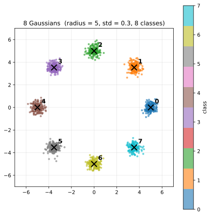

# Module 2.2 — Flow Matching with CFG

> Part 2 — Diffusion Essentials · [DiT from Scratch](../README.md)

**Goal**: train a small denoiser on a 2-D toy distribution using **flow matching** (the production-grade training paradigm used by SD3, FLUX, Lumina-T2X, etc.) with **classifier-free guidance (CFG)**. Visualize how the model flows points from noise to data, how few sampling steps it actually needs, and how CFG controls conditioning strength. A brief comparison with DDPM (the historical paradigm) shows what flow matching replaced and why.

**Why this matters for DiT**: this lab is the *training paradigm* DiT will use end-to-end. The MLP here gets swapped for a DiT in lab 3.2, and the 2-D points get swapped for image latents — but the loss, the sampler, and the CFG mechanism stay exactly the same. Lab 3.2 reuses this training loop verbatim with a DiT + VAE plugged in.

## Background: text embeddings

Production text-to-image / text-to-video models (WAN, LTX, SD3, FLUX) condition generation on a **text embedding** — a continuous vector produced by a pretrained text encoder (CLIP, T5, UMT5) from the user's prompt. The DiT then samples from `p(video | embedding)` rather than the unconditional `p(video)`. This lab uses the simplest possible stand-in for that text embedding — a single integer class label `c ∈ {0..7}` — to study the conditioning mechanism in isolation. Lab 3.3 swaps `c` for real text embeddings; the mechanism is identical.

The dataset used in this lab is **8 Gaussians** — eight small Gaussian blobs (std = 0.3) whose centers sit on a circle of radius 5. Each blob is a separate class (`c ∈ {0, …, 7}`).

<p align="center">
  
</p>

Four things change when you scale from class labels to text embeddings:

**Continuous, not discrete.** Every distinct text input maps to a different point in embedding space. A 200-word prompt isn't a "bigger class" — it's just a more specific point. Same-shape embedding for any prompt length:

```
"a cat"                                          →  embedding ∈ R^d
"a cat on a chair"                               →  embedding ∈ R^d
"a black-and-white cat lounging in sunlight"     →  embedding ∈ R^d
```

The video DiT never sees the words; it only sees the embedding vector.

**No fixed cluster count.** With 8 classes you have 8 conditional distributions. With text embeddings the conditioning space is *continuous*, so there are effectively infinite distinct conditional distributions — one per point in embedding space. Out-of-distribution prompts (gibberish, super-rare topics) produce worse output because that region of embedding space is sparsely covered by training data.

**The text encoder is pretrained and frozen.** Standard production setup:

```
  Text encoder (CLIP / T5 / UMT5)        Video DiT
  ─────────────────────────────         ─────────────────────────
  pretrained on huge text corpora;       trained on (video, embedding)
  weights FROZEN during DiT training    pairs via flow matching
```

The DiT learns to *use* the encoder's outputs but never updates the encoder. Text understanding is decoupled (CLIP/T5 are reused across many tasks); DiT only learns the video-given-embedding mapping.

**Similar embeddings → similar videos.** Text encoders are trained so semantically similar inputs land near each other in embedding space (`"a cat"` ≈ `"a kitten"` ≈ `"a fluffy cat"`). MSE training of the DiT makes the conditional output locally smooth in conditioning: small embedding change → small output change. This is what makes prompt engineering work — iterating from "a cat" to "a fluffy orange tabby in a sunbeam" slides through related regions of the conditioning space, and the generated video shifts accordingly.

**Toy ↔ production:**

| | This lab | Production video |
|---|---|---|
| Conditioning input | integer `c ∈ {0..7}` | text embedding ∈ `R^d` |
| How it enters the model | `nn.Embedding(8, dim)` lookup | frozen text encoder forward |
| Distinct conditions | 8 | continuous (effectively infinite) |
| Encoder trained jointly? | the embedding table, yes | text encoder, no (frozen) |
| Similar conditions → similar outputs | trivial (only 8 conditions) | the property that makes prompts useful |

The DiT's job is the same in both: take a conditioning vector, use it to disambiguate which kind of output to produce. Only the format of the conditioning vector changes.

## Why a 2-D toy


### Why we need a class label (the "conditioning" idea)


Production diffusion models all operate on tensors with thousands or millions of dimensions, but every paper still falls back to a 2-D toy at some point — because at 2-D you can **see the entire latent space** as a scatter plot. You can watch points flow from `N(0, I)` to the data distribution. You can see CFG concentrate samples toward their target mode. You can verify that flow matching converges in 2 steps where DDPM needs 100. None of that is visible at higher dimensions.

**This 8-class label is the toy stand-in for a text prompt in production.** SD3, FLUX, WAN, LTX all condition on text — "a cat on a chair" or "a video of a sunset" — embedded by a text encoder (CLIP, T5) and fed into the model. We use a single integer here for the same reason every diffusion paper does: it's the simplest possible conditioning signal, which lets you study the conditioning mechanism in isolation. Lab 3.3 swaps `c` for a real text embedding; the mechanism is identical.

```
class label `c`      ← simplest conditioning (one integer, this lab)
text prompt          ← richer conditioning (production text-to-image / video)
                       e.g. "a cat sitting on a chair" → embedded by CLIP/T5
                       and fed to the model the same way `c` is here
```

**Why do we need conditioning at all?** Without `c`, the model would have no way to know whether you want cluster 3 or cluster 7. Starting from the same noise point, every class is an equally valid target, so the loss forces the model to predict the **average** of all per-class velocities — and averaging eight directions on a circle gives **zero**. The unconditional model would predict no movement and produce nothing useful.

Adding `c` as an input breaks the ambiguity. During training the model sees `(x_t, t, c)` triples where `c` is the class `x_0` came from — `c=3` always means "the supervision target is a cluster-3 velocity," `c=7` always means "the target is a cluster-7 velocity," etc. The model is forced (by the loss) to *use* `c` to disambiguate; ignoring it would mean averaging back to zero. After training, set `c=3` at sampling time and the learned velocity field deterministically transports noise points to cluster 3.

**The deeper reason conditional models make more sense than unconditional ones.** Real data is rarely a single uniform distribution — it's a mixture of many distinct *kinds*. "All photos" isn't one distribution; photos of cats, photos of dogs, photos of cars are each their own. The unconditional objective `p(x)` asks the model to capture every kind *plus* their relative frequencies, all at once. The conditional objective `p(x | c)` lets the model focus on **one kind at a time** — a smaller, sharper task that matches how data is naturally structured. And it gives the user a way to ask for what they want: text-to-image without a text prompt would just hand you something random from the entire visual world. So conditioning isn't a workaround for the averaging-to-zero failure; it's the *right* way to model data that has structure. Every production text-to-image and text-to-video model is conditional for exactly this reason — the unconditional case is the degenerate extreme, useful for studying training dynamics but not what you'd ever deploy.

### What the model learns to do

The model learns a **velocity field over the 2-D plane** — a function that says "if a point is at position `x` at time `t`, conditioned on class `c`, *in which direction and how fast* should it move?"

```
input:   x  ∈ R²        — a 2-D point
         t  ∈ [0, 1]    — time
         c  ∈ {0..7}    — class label
output:  v  ∈ R²        — velocity vector (encodes both direction AND speed)
```

The vector's *direction* says which way to move. Its *magnitude* says how big a step the integrator should take per unit time — important because a point starting near the origin (`x_1 ~ N(0, I)`) needs to travel ~5 units of distance to reach a cluster center, and the velocity magnitude is what carries it that far. A unit vector wouldn't suffice — you'd only travel distance 1 over the integration.

**At training time**, the model is shown points sampled from the straight-line interpolation between data and noise:

```
x_0  ~ data  (one of the 8 clusters, radius ≈ 5)
x_1  ~ N(0, I)                  (noise, near origin)
t    ~ Uniform[0, 1]
x_t  =  (1 - t) · x_0  +  t · x_1                ← what the model sees
v*   =  x_1 - x_0                                ← the supervision target
```

So `x_t` lies somewhere on the line between a data point and a noise point. Repeated for many random `(x_0, x_1, t)` triples, the model learns the velocity over the entire region those lines fill — roughly the disk of radius 5.

**At sampling time**, you start at `x = x_1 ~ N(0, I)` (i.e., `x_t` at `t=1`, well outside any cluster) and integrate backward by Euler steps:

```
x ← x  +  (t_next - t) · model(x, t, c)         from t = 1 down to t = 0
```

When `t` reaches 0, `x` lands inside the cluster for class `c` — you've traversed one straight-line trajectory through the velocity field, from noise to data. `trajectory.png` shows those paths explicitly: straight lines from random starting points to the eight cluster centers.

## The forward process

The first thing every diffusion / flow-matching method needs is a **forward process** — a way to gradually destroy data with noise. Flow matching's choice is dramatically simpler than DDPM's:

### Flow Matching — straight line

```
x_t  =  (1 - t) · x_0  +  t · noise,    noise ~ N(0, I),    t ∈ [0, 1]
```

At `t=0`, `x_t = x_0` (the data). At `t=1`, `x_t = noise`. In between, you walk linearly in a straight line. That's it. One formula, no schedule.

The **velocity field** along this path is `v = noise - x_0` — it's *constant* along the entire path because the path is straight. (This is what "rectified flow" means: the flow is a rectified, i.e. straight, line.)

### DDPM — Gaussian Markov chain

For comparison, here's the same idea in DDPM's formulation:

```
β = linspace(1e-4, 0.02, T)              # T = 100, "noise schedule"
α_t = 1 - β_t,    ᾱ_t = ∏ α_s   for s ≤ t

x_t  =  √ᾱ_t · x_0  +  √(1 - ᾱ_t) · noise
```

Same shape as the flow-matching formula (a convex combination of data and noise) but with *coefficients chosen by a noise schedule* rather than just `(1-t, t)`. The math falls out of a Gaussian Markov chain `q(x_t | x_{t-1})`; the closed-form skip-to-`x_t` formula is derivable from that chain.

Both work. Flow matching is preferred because it has fewer moving parts, no schedule to tune, and the straight-line path makes few-step sampling effective.

## Training: predict the velocity (or the noise)

Train an MLP that takes `(x_t, t, class)` and outputs a 2-D vector. The supervision signal is what changes between paradigms:

| Paradigm | Target | Loss |
| --- | --- | --- |
| **Flow Matching** | velocity `v = noise - x_0` | `MSE(model(x_t, t, c), v)` |
| **DDPM** | noise `ε` | `MSE(model(x_t, t, c), ε)` |

That's the only training-time difference. Same architecture, same optimizer, same number of steps. (Flow matching loss is roughly twice as large in magnitude because `v = noise - x_0` is bigger than `ε`, but the optimization is equally easy.)

The training loop is ~30 lines (`train.py`):

```python
for step in range(N):
    x_0, y = sample_8gaussians(batch_size)
    t = torch.rand(batch_size)              # uniform in [0, 1]
    x_t, _, target_v = fm_q_sample(x_0, t)  # closed form
    pred = model(x_t, t, y)
    loss = (pred - target_v).pow(2).mean()
    loss.backward(); optim.step()
```

## Sampling: integrate the ODE

Once the model has learned the velocity field, **sampling is just integrating an ODE** from `t=1` (noise) backward to `t=0` (data):

```
dx/dt  =  v(x, t, c)            ← what the model predicts

Euler step:    x_{t-Δt} = x_t  -  Δt · v(x_t, t, c)
```

`fm_euler_sample` in `flow.py`:

```python
x = torch.randn(n_samples, 2)               # x_1 ~ N(0, I)
ts = torch.linspace(1.0, 0.0, n_steps + 1)
for i in range(n_steps):
    t = ts[i]
    v = model(x, t, classes)
    x = x + (ts[i+1] - ts[i]) * v           # dt is negative
return x
```

That's the entire sampler. **N=4 steps already produces well-shaped samples** for this toy (see `steps.png`). At N=1 you get the right cluster centers but no spread; by N=8 the output is essentially identical to N=50.

DDPM's sampler is more elaborate (`ddpm_sample` in `flow.py`): T ancestral steps with the posterior mean and variance, including the explicit `(1 - α)/√(1 - ᾱ) · ε` denoising correction and stochastic noise injection at each step. On this toy DDPM needs ~50–100 steps for similar quality — *the same model* sampled with a worse algorithm.

## Classifier-Free Guidance (CFG)

CFG is the trick that makes class / text conditioning controllable. It's used by *every* production text-to-image model. Two ingredients:

### Training: drop the label sometimes

During training, with probability `p` (here `0.1`), replace the class label with a special **null class**. The model thus learns *both* a conditional velocity `v(x, t, c)` and an unconditional one `v(x, t, ∅)` simultaneously, sharing all parameters.

```python
if random() < label_dropout:
    c = NULL_CLASS
```

That's the entire training-side change.

### Sampling: extrapolate

At sampling time, run the model *twice* per step — once with the real class, once with null — and extrapolate:

```
v = v_uncond  +  s · (v_cond - v_uncond)
```

`s = 1` is the model's natural conditional behavior. `s > 1` *extrapolates beyond it*, sharpening conditioning. `s = 0` ignores the class entirely (unconditional).

In our toy:

| `cfg_scale` | Behavior |
| --- | --- |
| `0.0` | unconditional — samples spread across all 8 modes |
| `1.0` | conditional — each class lands at its own cluster |
| `3.0` | concentrated — clusters tighten around their centers |
| `7.0` | over-concentrated — samples collapse onto the center, losing spread |

See `cfg.png` for the visualization. Production text-to-image models typically use `cfg_scale` in the 3–10 range — same trade-off (sharper conditioning vs realistic diversity).

## Files

| File | What it is |
| --- | --- |
| `data.py` | 8-Gaussians sampler |
| `mlp.py` | tiny MLP with sinusoidal time embedding + class embedding (with a null slot for CFG) |
| `flow.py` | `fm_q_sample` + `fm_euler_sample` (flow matching), `ddpm_q_sample` + `ddpm_sample` + `DDPMSchedule` (DDPM comparison) |
| `train.py` | training loop, `--paradigm fm\|ddpm`, `--label-dropout` for CFG |
| `sample.py` | sampling CLI; auto-picks Euler / ancestral based on the checkpoint's saved paradigm |
| `visualize.py` | four figures: `samples`, `trajectory`, `steps`, `cfg` |

## Instructions

### 1. Set up

Python 3.9+. From `lab2.2/`:

```bash
python -m venv .venv && source .venv/bin/activate
pip install -r requirements.txt
```

### 2. Train

Default: flow matching with CFG label-dropout = 0.1.

```bash
python train.py
```

10,000 steps in ~30 seconds on M3 MPS. Saves `model_fm.pt`.

To train the DDPM comparison model with the same architecture:

```bash
python train.py --paradigm ddpm
```

Saves `model_ddpm.pt`.

### 3. Visualize

```bash
python visualize.py --mode all
```

Produces four figures:

- **`samples.png`** — 200 samples per class, scattered, colored by class. Mode centers (`★`) overlaid for reference. Should produce eight tight clusters at the eight `★`s.
- **`trajectory.png`** — straight-line paths from noise to data for a few sample points. You can see flow matching produces *literal straight lines* — that's what "rectified" means.
- **`steps.png`** — the headline result. Same noise, same model, varying step count from 1 to 50. By step 4 the clusters have the right shape; step 8 is indistinguishable from step 50. Few-step sampling is what flow matching unlocks.
- **`cfg.png`** — same noise, varying CFG scale from 0 to 7. At `cfg=0` the model samples from the *unconditional* distribution (all classes mixed); at `cfg=7` samples collapse hard onto the conditional mode center. The 3–7 range is where production models live.

To compare flow matching against DDPM directly:

```bash
python visualize.py --mode all --ckpt model_fm.pt   --save-prefix fm_
python visualize.py --mode all --ckpt model_ddpm.pt --save-prefix ddpm_
```

Compare `fm_steps.png` vs `ddpm_steps.png` side by side: flow matching converges in 4–8 steps, DDPM needs 50–100. (`trajectory.png` is FM-only since DDPM's stochastic ancestral process doesn't produce smooth trajectories.)

### 4. Sample

```bash
python sample.py                              # 8 samples per class, default cfg=1
python sample.py --cfg-scale 3.0  --steps 10  # production-like settings
python sample.py --class-id 3 --n-per-class 32
```

## Discussion

**Why production picked flow matching.**

1. **Simpler math.** No `β` schedule, no `α_bar` accumulations, no posterior variances. One straight-line forward process, one ODE sampler, done. Reading SD3 / FLUX / Lumina papers no longer requires re-deriving DDPM's reverse process from scratch.
2. **Few-step sampling.** Because the path is straight, even Euler integration converges in very few steps. DDPM needs the hundreds of steps because its forward process is curved and the reverse process has to follow that curvature.
3. **Better few-step quality.** When you do go to few steps (production needs fast inference), flow matching's predictions are simply more useful — the velocity field is smoother and the path is shorter.

**What's identical across the two paradigms.**

- Network architecture, input format `(x, t, c)`, time embedding, class embedding.
- Training loop shape: sample `t`, compute closed-form `x_t`, predict the target, MSE loss.
- CFG: works *identically* with both. Train with label dropout, sample with extrapolation. The mechanism is paradigm-agnostic.
- Variance preserved: both forward processes interpolate between data (variance 1, in this toy) and noise (variance 1).

**What changes for DiT (lab 3.2).**

| Property | This lab | Lab 3.2 (Latent DiT) |
|---|---|---|
| Model | tiny MLP, 2-D in / 2-D out | DiT (transformer with patchify) |
| Data | 2-D point cloud, 8 Gaussians | 32×32×4 latents from VAE encoder |
| Conditioning | class label in {0, ..., 7} | class label or text embedding |
| Training paradigm | flow matching | flow matching (same loss) |
| CFG | identical | identical |
| Sampler | Euler ODE | Euler ODE (or higher-order solver) |

Five of seven rows are identical. The training loss, the sampler, and CFG carry over unchanged. *That's why this lab uses an MLP with no apologies* — the pieces being demonstrated are paradigm-level, not architecture-level. Lab 3.1 introduces DiT properly; lab 3.2 swaps it in.

**Brief note on DDPM's place in the curriculum.**

DDPM is the historical foundation — every flow-matching paper still motivates against it. Knowing the contrast (Markov chain vs straight line, ε-prediction vs velocity, ancestral sampling vs ODE integration) is enough to read modern papers. Implementing the full DDPM machinery beyond what this lab does (cosine schedules, v-parameterization, posterior variance learning, DDIM derivation, classifier guidance) is academic at this point — production has moved on.
