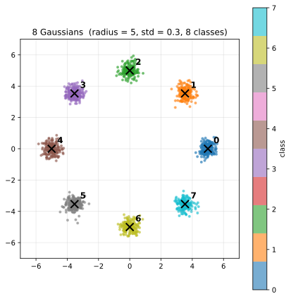
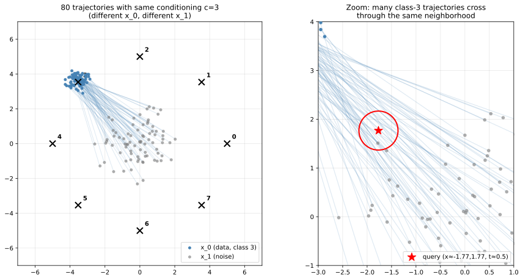

# Module 2.2 — Flow Matching with Conditioning

**Goal**: train a small denoiser on a 2-D toy distribution using **flow matching** — the production-grade training paradigm used by SD3, FLUX, Lumina-T2X, WAN, LTX, etc. — with **class conditioning** as the simplest stand-in for text conditioning. Visualize how the model flows points from noise to data, how few sampling steps it actually needs, and how **classifier-free guidance (CFG)** controls conditioning strength at sampling time.

**Why this matters for DiT**: this lab is the *training paradigm* DiT will use end-to-end. The MLP here gets swapped for a DiT in lab 3.2, and the 2-D points get swapped for image latents — but the loss, the sampler, and the conditioning mechanism stay exactly the same. Lab 3.2 reuses this training loop verbatim with a DiT + VAE plugged in.

## Background: text embeddings

Production text-to-image / text-to-video models (WAN, LTX, SD3, FLUX) condition generation on a **text embedding** — a continuous vector produced by a pretrained text encoder (CLIP, T5, UMT5) from the user's prompt. The DiT then samples from `p(video | embedding)` rather than the unconditional `p(video)`. This lab uses the simplest possible stand-in for that text embedding — a single integer class label `c ∈ {0..7}` — to study the conditioning mechanism in isolation. Lab 3.2 swaps `c` for real text embeddings; the mechanism is identical.

The dataset used in this lab is **8 Gaussians** — eight small Gaussian blobs (std = 0.3) whose centers sit on a circle of radius 5. Each blob is a separate class (`c ∈ {0, …, 7}`).

<p align="center">
  
</p>

Four things change when you scale from class labels to text embeddings:

1. **Continuous, not discrete.** Every distinct text input maps to a different point in embedding space. A 200-word prompt isn't a "bigger class" — it's just a more specific point. Same-shape embedding for any prompt length:

```
"a cat"                                          →  embedding ∈ R^d
"a cat on a chair"                               →  embedding ∈ R^d
"a black-and-white cat lounging in sunlight"     →  embedding ∈ R^d
```

The video DiT never sees the words; it only sees the embedding vector.

2. **No fixed cluster count.** With 8 classes you have 8 conditional distributions. With text embeddings the conditioning space is *continuous*, so there are effectively infinite distinct conditional distributions — one per point in embedding space. Out-of-distribution prompts (gibberish, super-rare topics) produce worse output because that region of embedding space is sparsely covered by training data.

3. **The text encoder is pretrained and frozen.** Standard production setup:

```
  Text encoder (CLIP / T5 / UMT5)        Video DiT
  ─────────────────────────────         ─────────────────────────
  pretrained on huge text corpora;       trained on (video, embedding)
  weights FROZEN during DiT training    pairs via flow matching
```

The DiT learns to *use* the encoder's outputs but never updates the encoder. Text understanding is decoupled (CLIP/T5 are reused across many tasks); DiT only learns the video-given-embedding mapping.

4. **Similar embeddings → similar videos.** Text encoders are trained so semantically similar inputs land near each other in embedding space (`"a cat"` ≈ `"a kitten"` ≈ `"a fluffy cat"`). MSE training of the DiT makes the conditional output locally smooth in conditioning: small embedding change → small output change. This is what makes prompt engineering work — iterating from "a cat" to "a fluffy orange tabby in a sunbeam" slides through related regions of the conditioning space, and the generated video shifts accordingly.


## Why a 2-D toy

Production diffusion models all operate on tensors with thousands or millions of dimensions, but every paper still falls back to a 2-D toy at some point — because at 2-D you can **see the entire latent space** as a scatter plot. You can watch points flow from `N(0, I)` to the data distribution. You can see CFG concentrate samples toward their target mode. You can verify that flow matching converges in just a few Euler steps. None of that is visible at higher dimensions.

**This 8-class label is the toy stand-in for a text prompt in production.** SD3, FLUX, WAN, LTX all condition on text — "a cat on a chair" or "a video of a sunset" — embedded by a text encoder (CLIP, T5) and fed into the model. We use a single integer here for the same reason every diffusion paper does: it's the simplest possible conditioning signal, which lets you study the conditioning mechanism in isolation. Lab 3.2 swaps `c` for a real text embedding; the mechanism is identical.

```
class label `c`      ← simplest conditioning (one integer, this lab)
text prompt          ← richer conditioning (production text-to-image / video)
                       e.g. "a cat sitting on a chair" → embedded by CLIP/T5
                       and fed to the model the same way `c` is here
```

### What the model learns to do

The model learns a **velocity field over the 2-D plane** — a function that says "if a point is at position `x` at time `t`, conditioned on class `c`, *in which direction and how fast* should it move?"

```
input:   x  ∈ R²        — a 2-D point
         t  ∈ [0, 1]    — time
         c  ∈ {0..7}    — class label
output:  v  ∈ R²        — velocity vector (encodes both direction AND speed)
```

The vector's *direction* says which way to move. Its *magnitude* says how big a step the integrator should take per unit time — important because a point starting near the origin (`x_1 ~ N(0, I)`) needs to travel ~5 units of distance to reach a cluster center, and the velocity magnitude is what carries it that far.

**At training time**, the model is shown points sampled from the straight-line interpolation between data and noise:

```
x_0  ~ data  (one of the 8 clusters, radius ≈ 5)
x_1  ~ N(0, I)                  (noise, near origin)
t    ~ Uniform[0, 1]
x_t  =  (1 - t) · x_0  +  t · x_1                ← what the model sees
v*   =  x_1 - x_0                                ← the supervision target
```

So `x_t` lies somewhere on the line between a data point and a noise point. Repeated for many random `(x_0, x_1, t)` triples, the model learns the velocity over the entire region those lines fill — roughly the disk of radius 5.

For a single conditioning class, the training data is a **fan of trajectories** — many lines from different points in the cluster to different noise samples, all sharing the same `c`:

<p align="center">
  
</p>

**Left**: 80 different `(x_0, x_1)` pairs, all conditioned on `c=3`. The trajectories form a cone — tight at the cluster, fanning out to the noise region. **Right**: zoom around a query point. Inside the red circle, many class-3 trajectories pass through at roughly the same `t`, each with a slightly different velocity (different `x_0`, different `x_1`). The model is asked to predict ONE velocity for that point, and MSE training makes it predict the **average** of all class-3 velocities passing through. This is exactly the same picture as production text-to-image, where `c=3` becomes a text embedding for, say, "a fluffy orange tabby" and the 80 trajectories become 80 different photos of fluffy orange tabbies all paired with random noise.

**At sampling time**, you start at `x = x_1 ~ N(0, I)` (i.e., `x_t` at `t=1`, well outside any cluster) and integrate backward by Euler steps:

```
x ← x  +  (t_next - t) · model(x, t, c)         from t = 1 down to t = 0
```

When `t` reaches 0, `x` lands inside the cluster for class `c` — you've traversed one straight-line trajectory through the velocity field, from noise to data. `trajectory.png` shows those paths explicitly: straight lines from random starting points to the eight cluster centers.

## The forward process

Flow matching's forward process — the way data is gradually destroyed with noise — is a single straight-line interpolation:

```
x_t  =  (1 - t) · x_0  +  t · noise,    noise ~ N(0, I),    t ∈ [0, 1]
```

At `t=0`, `x_t = x_0` (the data). At `t=1`, `x_t = noise`. In between, you walk linearly in a straight line. One formula, no schedule.

The **velocity field** along this path is `v = noise - x_0` — it's *constant* along the entire path because the path is straight. (This is what "rectified flow" means: the flow is a rectified, i.e. straight, line.)

## Training: predict the velocity

Train an MLP that takes `(x_t, t, class)` and outputs a 2-D vector. The supervision target is the velocity `v = noise - x_0`; the loss is plain MSE:

```python
loss  =  MSE( model(x_t, t, c) , noise - x_0 )
```

The training loop is ~30 lines (`train.py`):

```python
for step in range(N):
    x_0, y = sample_8gaussians(batch_size)
    t = torch.rand(batch_size)              # uniform in [0, 1]
    x_t, _, target_v = fm_q_sample(x_0, t)  # closed form
    pred = model(x_t, t, y)
    loss = (pred - target_v).pow(2).mean()
    loss.backward(); optim.step()
```

## Sampling: integrate the ODE (ordinary differential equation)

Once the model has learned the velocity field, **sampling is just integrating an ODE** from `t=1` (noise) backward to `t=0` (data):

```
dx/dt  =  v(x, t, c)            ← what the model predicts

Euler step:    x_{t-Δt} = x_t  -  Δt · v(x_t, t, c)
```

`fm_euler_sample` in `flow.py`:

```python
x = torch.randn(n_samples, 2)               # x_1 ~ N(0, I)
ts = torch.linspace(1.0, 0.0, n_steps + 1)
for i in range(n_steps):
    t = ts[i]
    v = model(x, t, classes)
    x = x + (ts[i+1] - ts[i]) * v           # dt is negative
return x
```

That's the entire sampler. (See `steps.png` from the visualize step for how few steps actually suffice in practice.)

## Classifier-Free Guidance (CFG)

CFG is the trick that makes class / text conditioning controllable. It's used by *every* production text-to-image model. Two ingredients:

### Training: drop the label sometimes

During training, with probability `p` (here `0.1`), replace the class label with a special **null class**. The model thus learns *both* a conditional velocity `v(x, t, c)` and an unconditional one `v(x, t, ∅)` simultaneously, sharing all parameters.

```python
if random() < label_dropout:
    c = NULL_CLASS
```

That's the entire training-side change.

### Sampling: extrapolate

At sampling time, run the model **twice** per Euler step — once with the real class, once with null — and extrapolate:

```
v = v_uncond  +  s · (v_cond - v_uncond)
```

`s = 1` is the model's natural conditional behavior. `s > 1` *extrapolates beyond it*, sharpening conditioning. `s = 0` ignores the class entirely (unconditional).

> **Cost: CFG doubles inference compute.** Every step now does two forward passes through the network instead of one. In this 2-D toy it's invisible, but in production (WAN, SD3, FLUX) it's a 2× wall-clock penalty per generation. This is a big deal — research like LCM, DMD2, and Wan-Lightning explicitly tries to fold the two passes into one (or distill them into a few-step student that doesn't need CFG at all).

In our toy:

| `cfg_scale` | Behavior |
| --- | --- |
| `0.0` | unconditional — samples spread across all 8 modes |
| `1.0` | conditional — each class lands at its own cluster |
| `3.0` | concentrated — clusters tighten around their centers |
| `7.0` | over-concentrated — samples collapse onto the center, losing spread |

See `cfg.png` for the visualization. Production text-to-image models typically use `cfg_scale` in the 3–10 range — same trade-off (sharper conditioning vs realistic diversity).

### From "null class" to "negative prompt"

The unconditional forward pass needs *some* embedding standing in for "no condition." In this toy it's a learned null-class entry — a single vector the model picked up while seeing dropped labels during training.

In production text-to-X (WAN, SD3, FLUX), the natural generalization is the **negative prompt**:

- **Positive prompt** drives the conditional pass: `v_cond = model(x, t, embed("a fluffy red panda"))`.
- **Negative prompt** drives the unconditional pass: `v_uncond = model(x, t, embed("blurry, low quality, distorted"))`.

You're still doing CFG — same formula, same 2× cost — but the "unconditional" pass is now actively pushing *away from* the negative prompt's content rather than just being a neutral baseline. Most pipelines default the negative prompt to the empty string `""` (which gives you something close to a true unconditional), but exposing it lets users steer generations away from artifacts they don't want. This is why `lab4.1/inference_diffusers.py` and `lab4.5/serve.py` both accept `--negative-prompt`.

Mechanically, lab 2.2's null class is the simplest instance of this: a special token in the embedding table for "no condition." Production scales the same idea up to a full text encoder.

## Files

| File | What it is |
| --- | --- |
| `data.py` | 8-Gaussians sampler |
| `mlp.py` | tiny MLP with sinusoidal time embedding + class embedding (with a null slot for CFG) |
| `flow.py` | `fm_q_sample` (forward process) + `fm_euler_sample` (Euler ODE sampler) |
| `train.py` | training loop, `--label-dropout` for CFG |
| `sample.py` | sampling CLI; calls `fm_euler_sample` |
| `visualize.py` | four figures: `samples`, `trajectory`, `steps`, `cfg` |

## Instructions

### 1. Set up

Python 3.9+. From `lab2.2/`:

```bash
python3 -m venv .venv && source .venv/bin/activate
pip install -r requirements.txt
```

### 2. Train

Default: flow matching with CFG label-dropout = 0.1.

```bash
python train.py
```

10,000 steps in ~30 seconds on M3 MPS. Saves `model.pt`.

### 3. Visualize

```bash
python visualize.py --mode all
```

Produces four figures:

- **`samples.png`** — 200 samples per class, scattered, colored by class. Mode centers (`★`) overlaid for reference. Should produce eight tight clusters at the eight `★`s.
- **`trajectory.png`** — straight-line paths from noise to data for a few sample points. You can see flow matching produces *literal straight lines* — that's what "rectified" means.
- **`steps.png`** — the headline result. Same noise, same model, varying step count from 1 to 50. **N=4 steps already produces well-shaped samples** for this toy. At N=1 you get the right cluster centers but no spread; by N=8 the output is essentially identical to N=50. Few-step sampling is what flow matching unlocks.

  **What each dot means:** the endpoint of one integration trajectory — `x_1 ~ N(0, I)` integrated for `N` Euler steps under a specific class label, producing a final 2-D position. Each panel has the same 800 dots (100 per class × 8 classes), drawn from the same starting noise (same seed). Only the step count `N` changes between panels.

  **Two things to look for:**

  1. **Dots scattered into the cluster shape = good.** The training data itself is a cluster with std=0.3, so a working model should *also* produce a cluster with std=0.3. Dots collapsing to a single point (no spread) means the model captured the *mean* but not the *variance* — every random seed would produce the same output, no diversity. Dots spread far beyond the cluster's true std means the model is over-diverse, generating samples the training data doesn't actually contain. Matching the training cluster's spread is the goal.

  2. **Fewer steps to reach that scattered shape = better.** Each Euler step is one model evaluation. FM's straight-line paths converge in 4–8 steps for this toy. At production scale this is the difference between "tens of model evaluations per image" and "a handful" — and what makes real-time video generation (LTX-style) feasible at all. So you're not just looking for "the model works" but "the model works *with as few steps as possible*."

  **Why N=1 collapses to cluster centers:** at the start (`t=1`), the model has no way to tell which *specific* point inside the cluster a given noise vector should head to — it only knows the class. So its prediction is "everyone aim for the cluster mean." With one giant Euler step at full speed in that direction, every starting noise lands exactly at the mean. **Why N=8 recovers the spread:** the model's velocity field has *position-dependent* corrections at intermediate `t` values. Multiple small steps sample those corrections, so different starting positions accumulate different deviations and end up at different points around the cluster — preserving the starting noise's variance as the data's variance.
- **`cfg.png`** — same noise, varying CFG scale from 0 to 7. At `cfg=0` the model samples from the *unconditional* distribution (all classes mixed); at `cfg=7` samples collapse hard onto the conditional mode center. The 3–7 range is where production models live.

## Discussion

**Why this is the production training paradigm.**

1. **Simple math.** One straight-line forward process, one ODE sampler. No noise schedule to tune, no posterior variances, no Markov-chain bookkeeping. Reading SD3 / FLUX / Lumina / WAN / LTX papers comes down to "the same recipe you have here, scaled up."
2. **Few-step sampling.** Because the path is straight, even plain Euler integration converges in very few steps. Real-time video generation (LTX-style) is feasible specifically because the integrator can stop after 4–8 evaluations with usable output.
3. **Architecture-independent.** The forward process, training target, sampler, and CFG mechanism are all defined over the *velocity field* — they don't care whether the network is an MLP, a UNet, or a DiT. Lab 3.2 swaps the MLP for a DiT and everything else carries over unchanged.

**What carries through to lab 3.2 (Latent text-to-image DiT).**

- Network input format `(x, t, c)`, time embedding, class/text embedding.
- Training loop shape: sample `t`, compute closed-form `x_t`, predict the velocity, MSE loss.
- CFG: identical mechanism (label dropout during training, extrapolation at sampling).
- The Euler sampler. (Production may swap in higher-order ODE solvers — Heun, RK4 — for slightly faster sampling, but the integration target is the same.)

What changes in lab 3.2: the MLP becomes a DiT, the 2-D point becomes an image latent, and the class label becomes a text embedding. The loss, the sampler, and the CFG mechanism are exactly what you build here.
